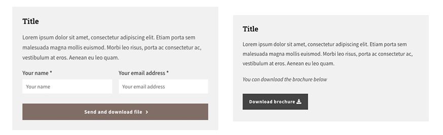
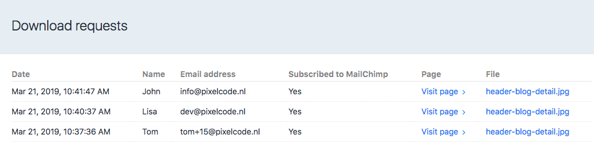

# Download Form plugin for Craft CMS 3.x

You can add a Download Form field to an entry/category to show a Download Form in twig (with MailChimp Subscribe support) to download an uploaded file. 

## Requirements

This plugin requires Craft CMS 3.0.0-beta.23 or later.

## Installation

To install the plugin, follow these instructions.

1. Open your terminal and go to your Craft project:

        cd /path/to/project

2. Then tell Composer to load the plugin:

        composer require PixelCodeNL/download-form

3. In the Control Panel, go to Settings → Plugins and click the “Install” button for Download Form.

## Download Form Overview

Add a download form to entries so a visitor can download a file after leaving his name and email address.

Install the MailChimp Subscribe plugin to enable MailChimp integration.

From the control panel you can view the entries and see  who downloaded the file(s) on which page(s).

## Configuring Download Form

#### Asset source downloads

This is the asset source for the download assets. The file selector only shows files from this asset source.

#### Notification email address

This is the email address used for sending a notification when a visitor has submitted the download form.

#### MailChimp list ID

List ID for the MailChimp list user should subscribe for.
When leaving blank, MailChimp subscriptions are skipped.

## Using Download Form

- Create a new asset source for the downloads.
- Configure the plugin in the plugin settings.
- Create a new field of type 'Download form'.
- Add the field to an section.
- Configure the download for an entry.
- Show the form by adding the following code to the template: 

  `{{ craft.downloadForm.render(entry) | raw }}`
  
  or
  
  `{{ craft.downloadForm.render(entry, options) | raw }}`

### Supported options

#### template : string

Overwrite the form template (see plugin folder: /download-form/templates/downloadForm.twig for the original).

#### fieldHandle : string

Overwrite the custom field handle, default 'downloadForm'.

## Changelog

### 2.0.0 -- 2019.03.21

* Completely redesigned the plugin with support for Craft 3
* Supports Project Config settings
* Added Demo templates 
* Added Social Tracking setting
* Added User permissions (per user and usergroup)
* Changed pagination method

---
Copyright © 2019 - [Pixel&amp;Code](https://www.pixelcode.nl)
